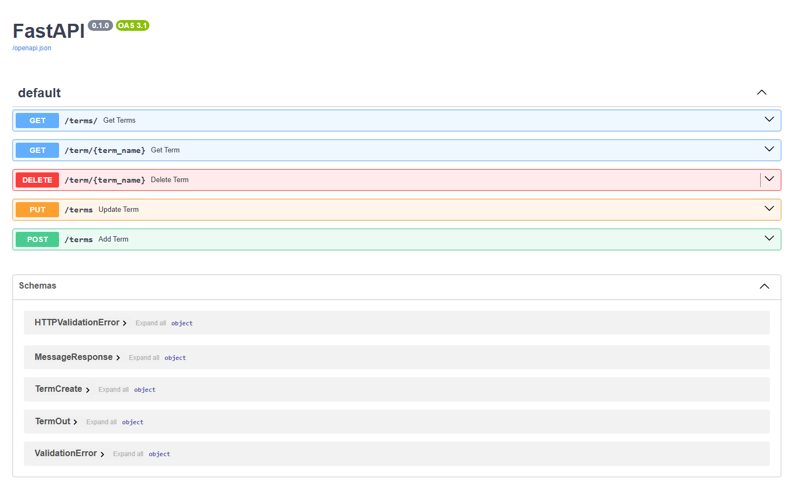
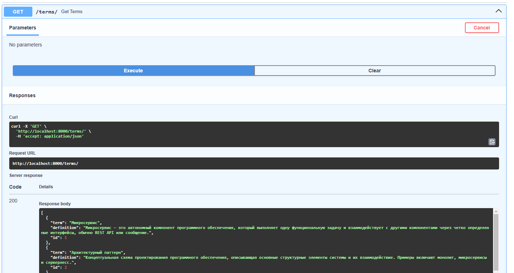
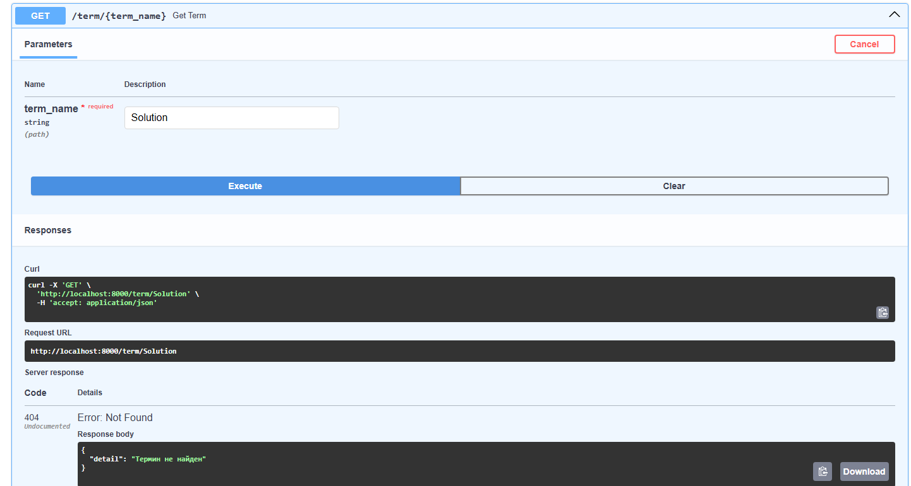
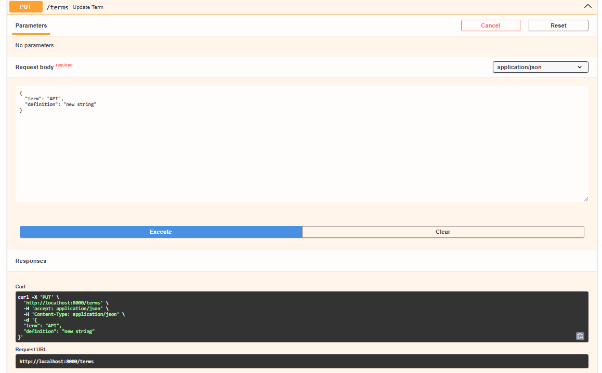
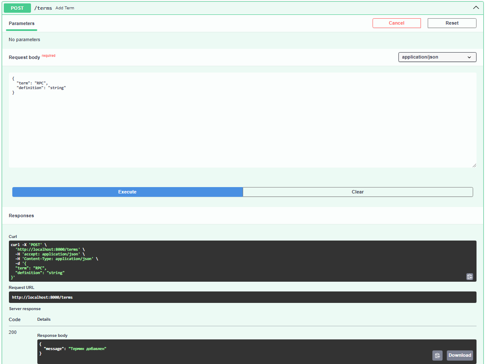
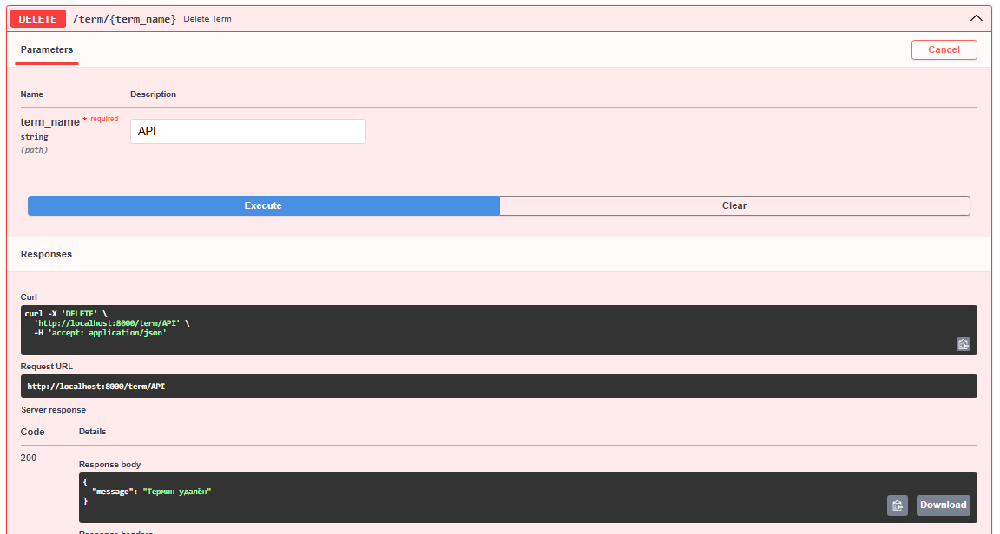

# RPC. gRPC. Protobuf

### В проекте представленны файлы 
- db.py - конфигурация подключения к базе данных
- initial_terms.py - начальные термины для заполнения 
- models.py - модель таблиц в базе данных
- schemas.py - типы данных для запросов и ответов
- glossary.proto - деклариция типов данных
- glossary_pb2(_grpc) - сгененирированные на основе .proto-файла необходимые для передачи данных файлы (классы на Python для выполнения запросов и получения ответов).
- rest_server.py - файл клиента приложения с описанием роутов
- server.py - сервис взоимодействия с базой данной по RPC


Для создания контейнера приложения представлен Dockerfile:

```
FROM python:3.11-slim

WORKDIR /app
COPY requirements.txt .
RUN pip install --no-cache-dir -r requirements.txt

COPY ./app /app

CMD ["uvicorn", "app.main:app", "--host", "0.0.0.0", "--port", "8000"]
```

Для запуска контейнера docker-compose:

``` 
services:
  app:
    build:
      context: .
      dockerfile: Dockerfile
    ports:
      - "8000:8000"
    volumes:
      - .:/app
    command: uvicorn app.main:app --host 0.0.0.0 --port 8000 --reload
```

## Для запуска проекта необходимо

1. Клонировать проект
```aiignore
git clone https://github.com/777DreamMaster/FastApiGlossary.git
```
2. Собрать и запустить контейнеры:
```bash
docker-compose up --build
```
OpenApi будет доступно по адресу:

```bash
http://localhost:8000/docs
```





